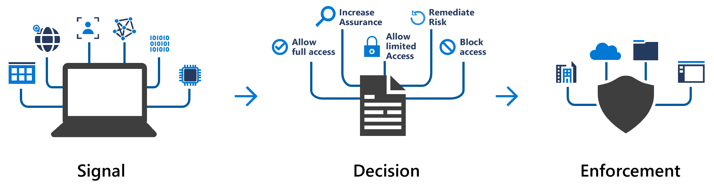
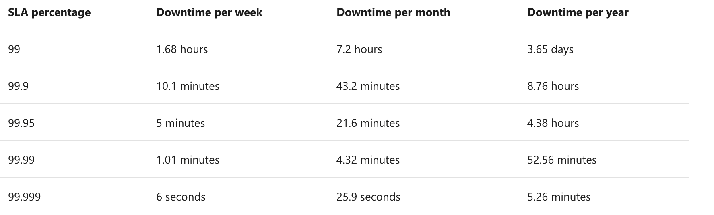
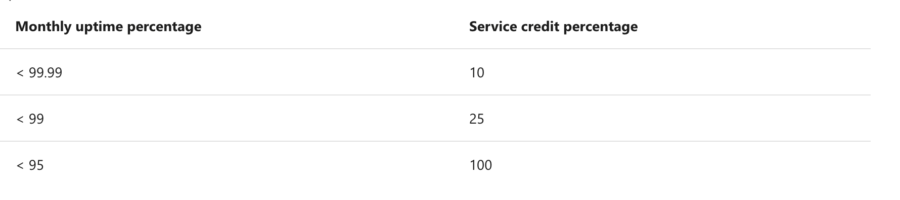

slidenumbers: true
footer: *AZ900 Exam prep 1* - @jlengrand - _https://github.com/jlengrand/az-900/slides_

# AZ900 - Session 2

---

# Today

* Second half of the materials
* Some practical questions
* Hopefully some questions :)

---

# Some helpful links : 

* [Those slides](https://github.com/jlengrand/az-900/slides) 
* [The study materials](https://docs.microsoft.com/en-us/learn/certifications/exams/az-900)
* [Azure portal](https://azure.microsoft.com/en-us/features/azure-portal/)
* [az900 in 3 hours from FreeCodeCamp](https://www.youtube.com/watch?v=NKEFWyqJ5XA&t=5657s)
* [Whizlabs to train yourself](https://www.whizlabs.com/microsoft-az ure-certification-az-900/)

Sign into docs using your own email

---

# Registering for the exam

---

# Study and the groups

* Please come and study
* Please take the exam

---

# About the exam

* Use your own laptop if you can
* Prepare well
* Try out questions and 'frame yourself'

---

# For the exam

---

# TODAY

* Azure Fundamentals part 4: Describe general security and network security features
* Azure Fundamentals part 5: Describe identity, governance, privacy, and compliance features
* Azure Fundamentals part 6: Describe Azure cost management and service level agreements

---

# Describe general security and network security features

---

# Protect against security threats on Azure

---

## Azure Security Center

* [Azure Security Center](https://portal.azure.com/#blade/Microsoft_Azure_Security/SecurityMenuBlade/18)
* CyberSecurity, controls, both on and off cloud
* Recommendations, Machine Learning
* Security Alerts
* Enforce rules

---

## Azure Security Center - Overview

---

## Secure Score

* Score based on security controls
* Identities, data, apps, devices, and infrastructure

---

## Azure Sentinel

* [Azure Sentinel](https://portal.azure.com/#blade/HubsExtension/BrowseResource/resourceType/microsoft.securityinsightsarg%2Fsentinel)
* Security information and event management (SIEM)
* Using cloud data
* Use AI and detect advanced threats
* Build automation and orchestration

---

## Azure Sentinel

* Entreprise feature
* Data sources : Office 365, AD, ....
* But also external : Okta, CloudTrail, Citrix, ...
* Graphs, Stats and Relations of investigation
* Automation using [Azure Monitor Workbooks](https://docs.microsoft.com/en-us/azure/azure-monitor/visualize/workbooks-overview)

---

## Azure Key Vault

* [Azure Key Vault](https://portal.azure.com/#blade/HubsExtension/BrowseResource/resourceType/Microsoft.KeyVault%2Fvaults)
* Manage Secrets, encryption keys, SSL certificates, hardware security module (HSM)
* Centralize secrets, monitoring and simple admin, integration

---

## Azure Dedicated Hosts

* Azure VMs, shared hardware
* Compliancy might require dedicated hosts.
* Specific VM size, series, power, ...
* $$$$

---

## Azure Dedicated Hosts

---

# 4 - Knowledge check

* [Knowledge Check](https://docs.microsoft.com/en-us/learn/modules/protect-against-security-threats-azure/7-knowledge-check)

---

# Describe identity, governance, privacy, and compliance features

---

## Authentication and authorization

* Authentication : Who are you? Prove it! 
* Authorization : I know who you are. Are you allowed to do/see this?

---

## Active Directory

* Allows to manage infrastructure by giving users a single way to log in.
* Identity and Access Management
* Azure AD : The cloud, managed version of AD. Microsoft ensure availability
* Adds suspicious log-in detections. 

---

## Azure AD

* AAD is for everyone 
* Admins : Create and manage access to apps and resources
* Devs : Standard approach for auth.
* Users : reset, manage info, log in, ...
* Seemless integration with cloud environments (Office 365, ...)

---

## Azure AD

* Single Sign On (SSO) : Only one username / pw. Easy way to manage users!
* Authentication, Multi factor, ...
* App Management 
* Devices too! 

---

## MultiFactor Auth?

* Something you know, something you are, something you have

* Extra security in today's world
* Azure AD Multi-Factor Authentication

---

## Conditional Access

* Conditional Access, you need an Azure AD Premium P1 or P2 license

---

---

# Describe Azure cost management and service level agreements

---

REgulationsss??????

---
---

## Total Cost of Ownership

* [TCO Calculator](https://azure.microsoft.com/pricing/tco/calculator)
* Contains licenses, hardware, maintenance labor, electricity, 
* Software Assurance -> Reuse of your existing licenses     

---

## Total Cost of Ownership

---

## Azure Subscriptions

* Free trial (12 months, 25 services, some always free)
* Pay-as-you-go
* Member offers (existing customers like Startups, Imagine, ...)

---

## Purchasing 

* Through an Enterprise Agreement
* From the web
* Through a Cloud Solution Provider

---

## Cost factors

* Resource type (ex : type, performance tier, access tier)
* Usage meters (depends on the service, CPU, Ram, Disk, IP)
* Resource Usage (resource exists. VM, disks, ...)
* Subscription type
* Location and Network

* Azure Dev/Test pricing
* Special offers

---

## Azure Pricing calculator

* [Azure Pricing Calculator](https://azure.microsoft.com/en-us/pricing/calculator/)
* Example Scenarios
* Saved Estimates

---

## Azure Advisor

* [Azure Advisor](https://portal.azure.com/#blade/Microsoft_Azure_Expert/AdvisorMenuBlade/overview)
* Spending limits
* Azure Reservations (>70% discounts). 1 to 3 years prepaid
* Low cost regions
* Azure Cost Management + Billing (reporting, budget, alerting, tags, ...)

---

## Cost reduction strategies 

* Resize underutilized virtual machines
* Deallocate virtual machines during off hours
* Delete unused resources
* Migrate from IaaS to PaaS services
* Save on licensing costs
* Azure Hybrid Benefit - Software Assurance

---

## SLAs - Service Level Agreements

* [SLA Page](https://azure.microsoft.com/support/legal/sla/)
* One for each service
* Free products don't have a SLA
* [Azure Status](https://status.azure.com/status) to get health of services.

---

## Uptime / Downtime

---

## Service Credits after claims

---

## Defining your SLA

* Uptime / Money
* Need and behaviour of users?
* SLAs are harder than they look :).

---

## Composite SLA

---

## Composite SLA

---

## Adjusting SLA

* Different products have different SLA (Example, disks)
* Service tiers
* Include redundancy

---

## Availability Zone 

* Unique physical location within an Azure region.
* One or more datacenters with independent power, cooling, and networking
* Different schedules for maintenance

---

## Service lifecycle

* Releasability of services to the public
* Dev phase
* Public preview
* General available (GA) -> Customer support
* [Some preview services](https://portal.azure.com/#blade/Microsoft_Azure_Resources/PreviewFeaturesBlade)
* [The preview portal](https://preview.portal.azure.com/#home)
* [Azure updates](https://azure.microsoft.com/updates) for latest info

---

---

# For now

--- 

# Let's have some fun

---

---

---

---

---

---

---

---

---

---

---

---

---

---

---

---

---

