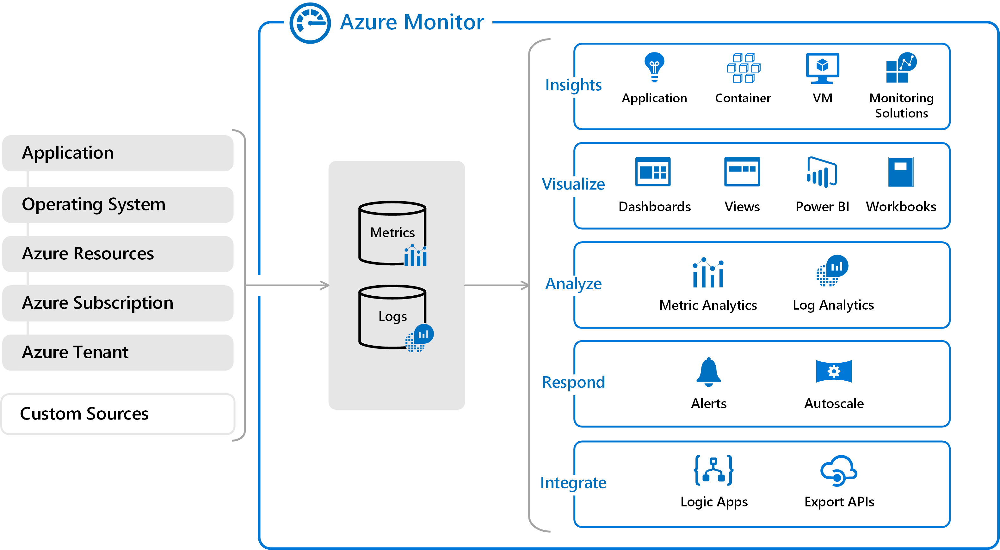

slidenumbers: true
footer: *AZ900 Exam prep 1* - @jlengrand - _https://github.com/jlengrand/az-900/slides_

# AZ900 - Session 2

---

# Today

* Second half of the materials
* Some practical questions
* Hopefully some questions :)

---

# Some helpful links : 

* [Those slides](https://github.com/jlengrand/az-900/slides) 
* [The study materials](https://docs.microsoft.com/en-us/learn/certifications/exams/az-900)
* [Azure portal](https://azure.microsoft.com/en-us/features/azure-portal/)
* [az900 in 3 hours from FreeCodeCamp](https://www.youtube.com/watch?v=NKEFWyqJ5XA&t=5657s)
* [Whizlabs to train yourself](https://www.whizlabs.com/microsoft-az ure-certification-az-900/)

Sign into docs using your own email

---

# Registering for the exam

---

# Study and the groups

* Please come and study
* Please take the exam

---

# About the exam

* Use your own laptop if you can
* Prepare well
* Try out questions and 'frame yourself'

---

# For the exam

---

# Cloud computing - Core concepts

---

## IAAS, PAAS, SAAS

---

## IAAS, PAAS, SAAS

---

## Private, Hybrid and Public cloud

---

## Why the cloud

Reliable, Scalable, Elastic, Agile, Geo-Distributed, Disaster Recovery

---

## What is Azure

Azure Portal and Azure Marketplace

---

## Azure Services

---

## Azure accounts

---

# Azure Core Services

---

## Azure Core Services

* [Complete Overview](https://docs.microsoft.com/en-us/learn/modules/intro-to-azure-fundamentals/tour-of-azure-services)

---

## Azure Core Services

* Data
* Compute
* Storage
* Networking

---

## Azure database and analytics services

---

## Azure Cosmos DB

* [Azure Cosmos DB](https://docs.microsoft.com/en-us/learn/modules/azure-database-fundamentals/azure-cosmos-db)
* SchemaLess
* Flagship product
* Fully scalable

---

## Azure SQL Database

* Microsoft SQL Server
* PaaS
* You can migrate from on premise

---

## Azure SQL Database

* Creating one - Exercise

---

## Azure SQL Managed Instance

* [Almost SQL Database](https://docs.microsoft.com/en-us/azure/azure-sql/database/features-comparison)

---

## And more

* Azure database for MySQL
* Azure Database for PostgreSQL

---

## Big data and analytics

Lots of stuff, can't move in a DB

* Azure Synapse Analytics (SQL Queries on warehouse, reporting)
* Azure HDInsight (Spark, Hadoop, Kafka AAS)
* Azure Databricks (Specialized Spark with APIs)
* Azure Data Lake Analytics

---

## Azure compute services

---

## All services

---

## All services

* [LOL](https://portal.azure.com/#allservices)

---

## VMs and VM scale sets

* When you need a _computer_ (OS, VPN, software, ...)
* When you start going hybrid
* Scale Set - Deploy multiple similar VMs
* (Azure Batch, supercomputer like)

---

## Containers and Kubernetes

* Deploy and manage containers
* Default if not specified
* Orchestration, Fast, Reliable, ...
* Container Instances (Docker AAS)
* AKS k8s AAS

---

## App Service

* PAAS
* Entreprise
* Mobile apps, API apps, WebApps, ...
* Glue between services

---

## Functions

* MicroBilling
* Big big push in the industry
* Serverless, Infinite scalability, Event driven

---

## Logic Apps

* Also Serverless
* Connectors
* Drag and Drop
* No software developers

---

## Virtual Desktop and Logic Apps, ...

* Computer in the cloud
* Drag and Drop for workflows

---

## Azure Storage services

---

## Types

* Disk Storage (VMs, . . .)
* Blob storage (Video, images, documents, archiving)
* Files (SMB, NFS, Fileshares)

---

# About containers and access tiers

* Hot, Cool (30 days), Archive (180 days)

---

## Azure Networking services

---

## Virtual Networks

* Separated section of the Azure Network (IP addresses)
* Resources HAVE to go in a VNet
* you divide VNets into Subnets (IP ranges)
* Public subnets, private subnets

---

## VPN and connections

* Express Route - On prem to cloud connection, with bandwidth
* Azure Connection - VPN to connect two local Az networks

---

## VPN gateway

* From site to site
* From device to site
* Policy based or route based

---

## Types

* Virtual Networks (Router as a service)
* VPN Gateway (Policy or routing based)

---

# Core solutions and management tools on Azure

---

## AI Solutions

---

## Types

* Azure Machine Learning -> DIY ML
* Azure Cognitive -> TY Azure, use as API
* Bot Service -> Create automated bots. Communication with human

---

## Azure Machine Learning 

* Private, historical data
* Special case, not in cognitive

---

## Azure Cognitive Services 

---

## Azure DevOps

---

## Azure DevOps

---

## Monitoring Services

---

## Azure Advisor

* [Advisor](https://portal.azure.com/#blade/Microsoft_Azure_Expert/AdvisorMenuBlade/overview)
* Improve your reliability, costs, performance, security

---

## Azure Monitor

* [Monitor](https://portal.azure.com/#blade/Microsoft_Azure_Monitoring/AzureMonitoringBrowseBlade/overview)
* Metrics and Logging, Alerting

---

## Azure Service Health

* [Service Health](https://portal.azure.com/#blade/Microsoft_Azure_Health/AzureHealthBrowseBlade/plannedMaintenance)
* Actual Azure outages, maintenance, ... Is the problem on my hand?

---

## Managing and Configuring Azure

---

## Options

* Portal - Visually understand 
* PowerShell / CLI - One off operations 
* (Mobile) App - Monitor quickly, on the go
* ARM Templates - Repetitive tasks (Infra as code)

---

## IOT Services

---

## IOT Services

* IOT Hub - Managed central comm. hub
* IOT Central - dashboards, manage IOT devices (UI, templates)
* Sphere - Create secure IOT solutions. Specialized OS

---

---

# For now

--- 

# Let's have some fun

---

---

---

---

---

---

---

---

---

---

---

---

---

---

---

---

---

